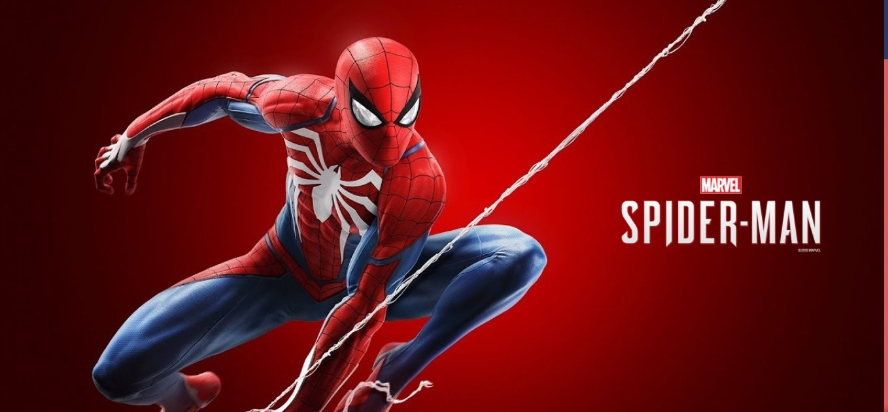
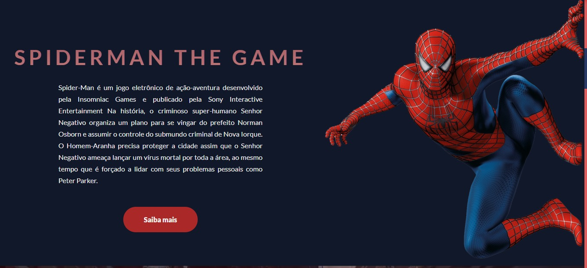
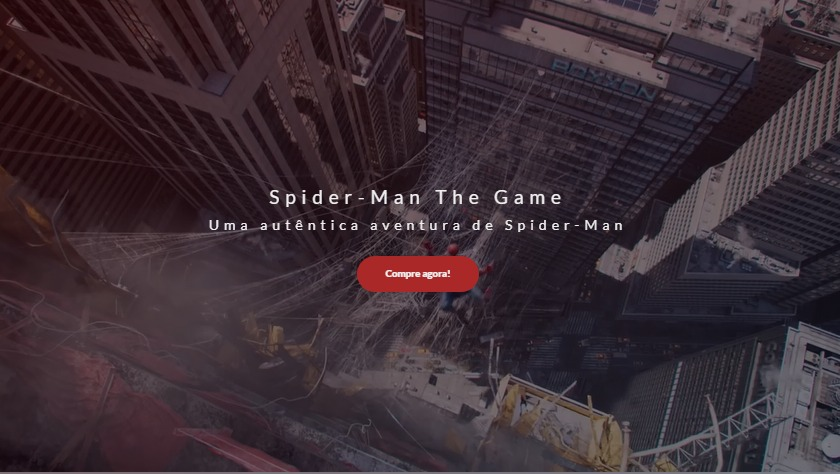
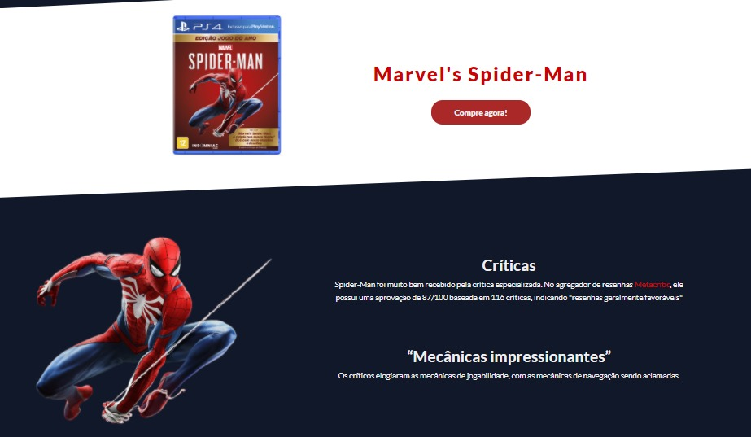

# Spider-man project 🕷

### 🕸 *Spider-man website*  🕸

A fictional project that aims to promote the Marvel's Spider Man PS4 game.

The website presents the user a few information regarding the game, its content and story and also a background trailer.

I've created this project to study and apply responsive web layout techniques making use of mixins, inheritance, variables and styles with *SASS*.

### This project was created with 

- ### *HTML5*

- ### *CSS3*  

- ### *SASS*

### Header 

### About the game

### Trailer

### Critics about the game

# Video

Check out the link below to see the project presentation video.

https://www.linkedin.com/feed/update/urn:li:activity:6787771542475481088/

### Thanks everyone! ✔

###### Developed by Gabriel Vicente 
