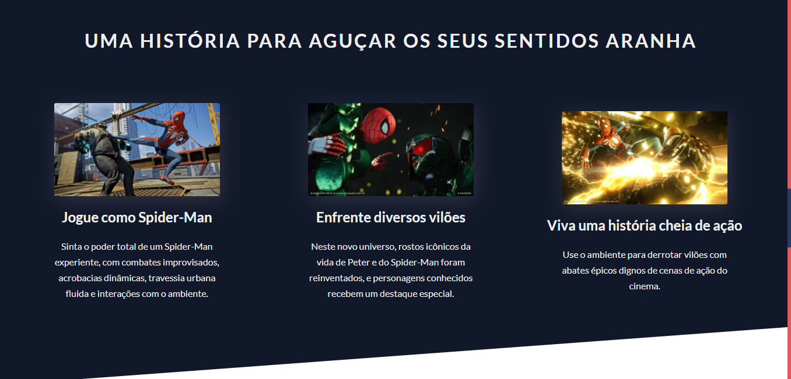
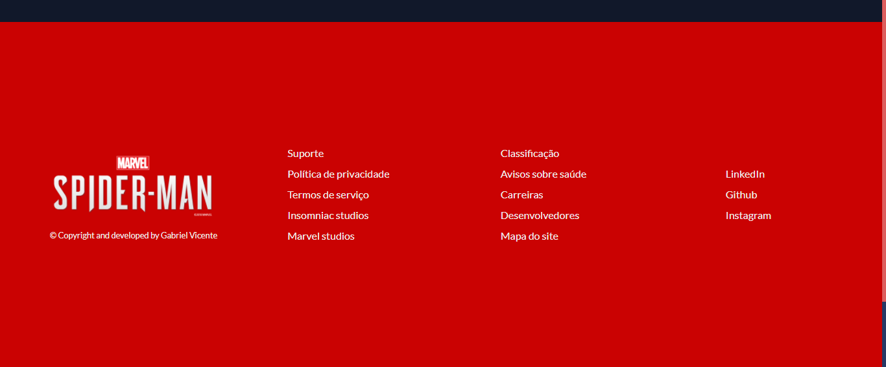

# Spider-man project 🕷

### 🕸 _Spider-man website_ 🕸

A fictional project that aims to promote the Marvel's Spider Man PS4 game.

The website presents the user a few information regarding the game, its content and story and also a background trailer.

I've created this project to study and apply responsive web layout techniques making use of mixins, inheritance, variables and styles with _SASS_.

### This project was created with

- ### _HTML5_

- ### _CSS3_

- ### _SASS_

### Header

### About the game

### Trailer

### History

### Critics about the game

### Footer

# Video

Check out the link below to see the project presentation video.

https://www.linkedin.com/feed/update/urn:li:activity:6787771542475481088/

### Thanks everyone! ✔

###### Developed by Gabriel Vicente
